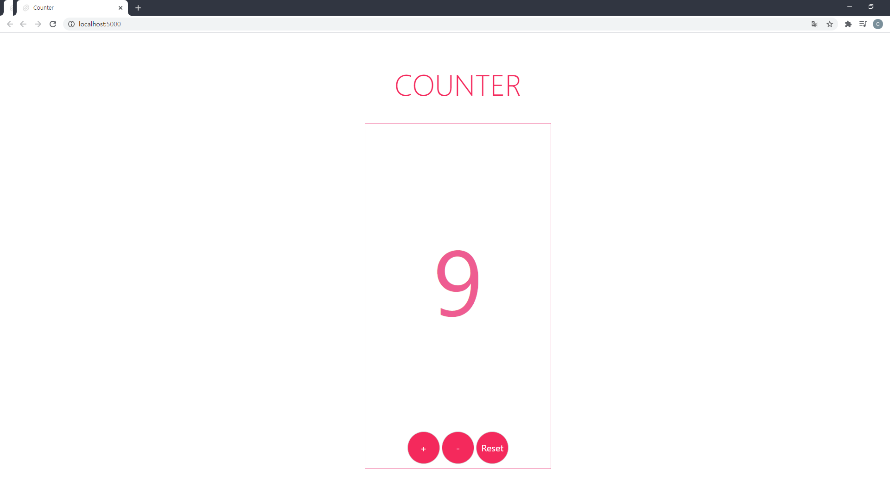

*Looking for a shareable component template? Go here --> [sveltejs/component-template](https://github.com/sveltejs/component-template)*


# Counter


---


## Get started

Install the dependencies...

```bash
cd svelte-app
npm install
```

...then start [Rollup](https://rollupjs.org):

```bash
npm run dev
```
